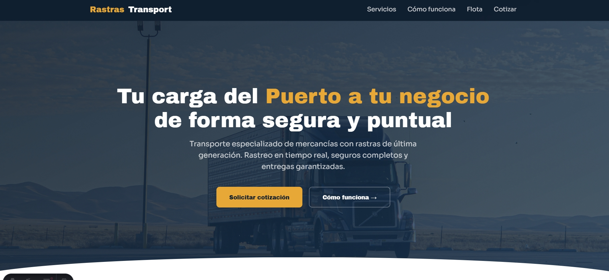
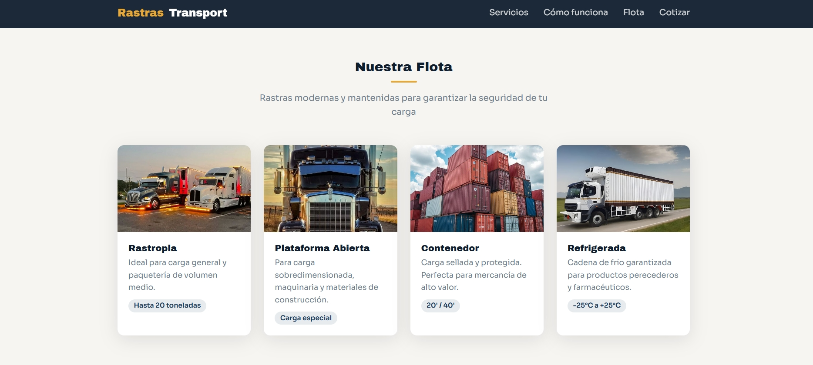

# Rastras Transport — Landing Page

Landing page corporativa para empresa de transporte de carga terrestre con logística portuaria.

## Stack

- **Astro** 6.4.6 · **TypeScript** strict
- **Tailwind CSS** v4 (Vite plugin)
- **pnpm** 10.33.2 · **Node** >= 22.12

## Arquitectura

```
src/
├── pages/
│   └── index.astro        # Ruta única (SSG)
├── layouts/
│   ├── Layout.astro        # Shell HTML + fonts + scroll-reveal
│   ├── Navbar.astro        # Navegación fija
│   └── Footer.astro        # Footer
├── components/
│   ├── Hero.astro          # Hero con parallax + curva SVG
│   ├── Stats.astro         # Contadores animados al hacer scroll
│   ├── Services.astro      # Grid de 6 servicios
│   ├── HowWork.astro       # 4 pasos numerados
│   ├── Cars.astro          # Tarjetas de flota
│   ├── CTA.astro           # Call to action con datos de contacto
│   └── Contact.astro       # Formulario de cotización
├── styles/
│   └── global.css          # Tailwind v4 + design system (colores, tipografía, sombras)
└── assets/
    └── imgs/               # Imágenes optimizadas
```

Single Page Application con Astro (SSG). Cada sección es un componente `.astro` aislado. Animaciones via IntersectionObserver inline. Sin framework de JS — solo Astro + CSS nativo.

## Secciones

Hero · Estadísticas animadas · Servicios (6 tipos) · Cómo funciona (4 pasos) · Flota (4 tipos de rastra) · CTA con contacto · Formulario de cotización

## Preview





## Comandos

```sh
pnpm install   # instalar dependencias
pnpm dev       # dev server → localhost:4321
pnpm build     # build → ./dist/
pnpm preview   # previsualizar build
```
